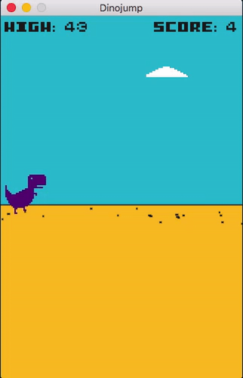

# Dinojump

A simple game based on the chrome offline dinosaur game.



## Things used

+ [Lua 5.2.4](http://www.lua.org/)
+ [LÖVE 0.10.2](https://love2d.org/), a lua 2d framework for lua
+ [anim8](https://github.com/kikito/anim8), a sprite animation library for LÖVE
+ [Piskel](http://www.piskelapp.com/), a web app for making sprites

## Run
```
love .
```

## Distribution
[Wiki](https://love2d.org/wiki/Game_Distribution)
